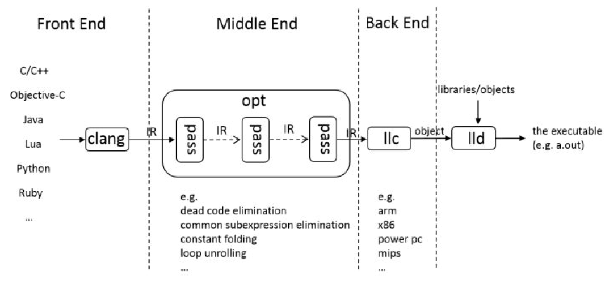
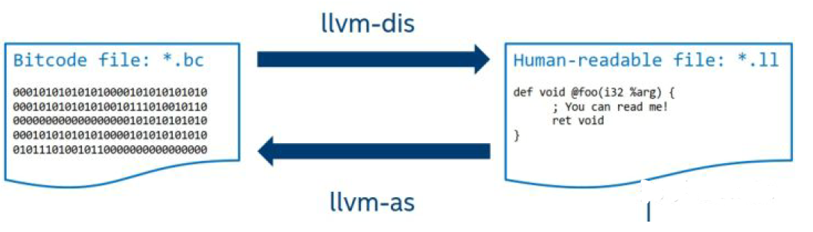
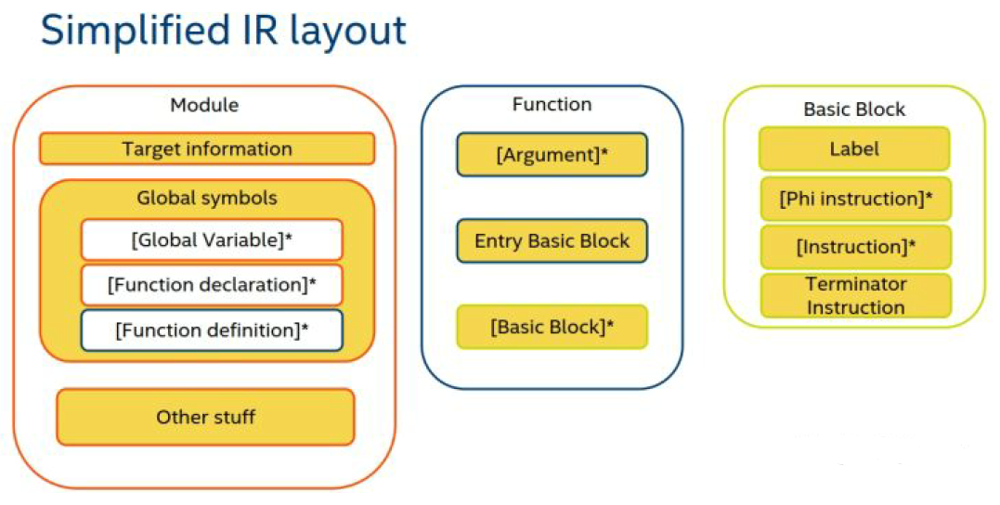
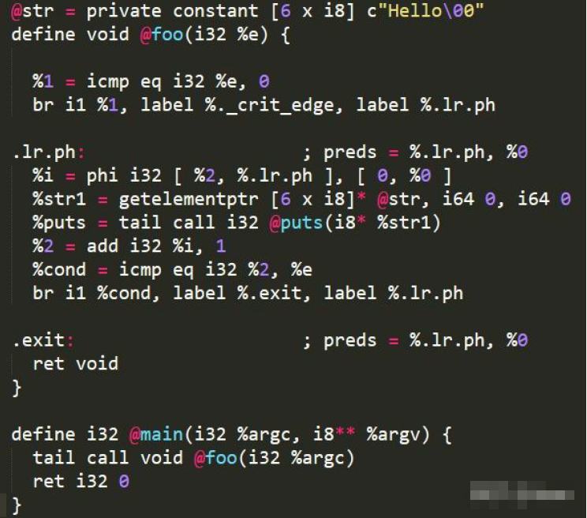
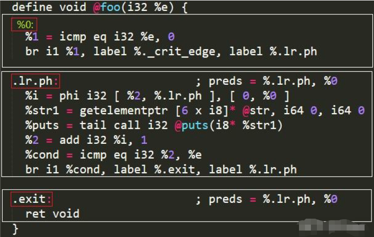
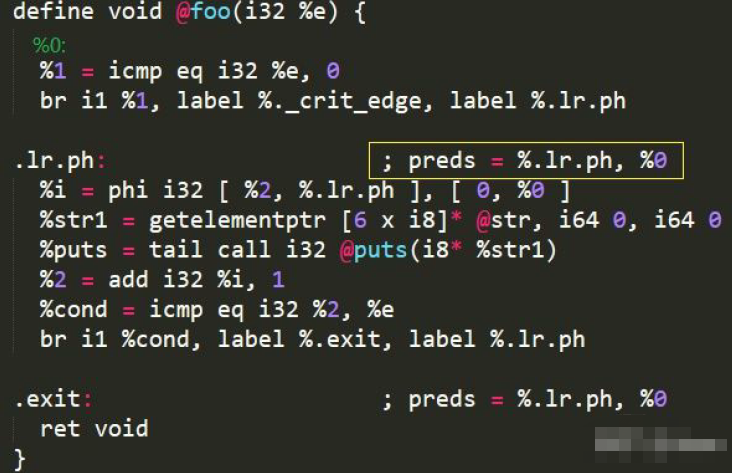

## 引言
现代程序员写程序一般都是使用高级语言（例如C、C++、Objective-C）来进行书写的，每种高
级语言都有其独特的语法，使用相同的算法和相似的数据结构实现同一个功能，不同的语言写出来
的也是不一样的。对于编译器来说，如果能够屏蔽这些语法带来的差异，将程序转换成一种共通的
语言来表示，那么就可以专心的针对这个共通的语言来研究如何对其优化，使得最后生成的程序能
够更优（从时间、空间等方面）。相关的优化算法实现也因此具有通用性、可重用性。



在LLVM中，这个共通的语言，就是LLVM IR。IR是Intermediate Representation的缩写，即中间描述或者中间表示。在LLVM中，Clang主职前端（Front End），Clang的输入是各种高级语言
书写的源代码，然后Clang对其进行词法分析、语法分析、语义分析，形成抽象语法树，然后通过LLVM IR代码生成器（LLVM IR Code Generator）将这些源代码转换成LLVM IR。接着中端的
LLVM优化器（Optimizer）以LLVM IR为输入，对其进行优化。由于各种高级语言书写的源代码都被转换成了相应的功能对等的LLVM IR，优化器不用关心这些代码原来是什么样子，统一面对的
都是LLVM IR，只要针对这个IR代码做优化就可以了。笔者收集了一些资料[<sup>1</sup>](#refer-anchor-1)[<sup>2</sup>](#refer-anchor-2)[<sup>3</sup>](#refer-anchor-3)[<sup>4</sup>](#refer-anchor-4)[<sup>5</sup>](#refer-anchor-5)，并基于这些资料，对LLVM IR做一些浅显的介绍。

LLVM IR有三种存在形态:
1. 编译器运行的时候，IR在内存中的形态
2. 以二进制格式存储在文件中的形态(.bc)
3. 以可读的文本形式存储在文件中的形态(.ll)



下面将介绍，使用clang命令将高级语言（以c为例）写的源文件转换成可读的LLVM IR文件。
```
clang hello.c -emit-llvm -S
```
此时会生成一个hello.ll文件，可以直接使用文本编辑软件打开，直接阅读IR指令。
如果要生成二进制形式的LLVM IR文件，则使用如下命令
```
clang hello.c -emit-llvm -c
```
此时，会生成一个hello.bc文件。
使用llvm-dis命令和llvm-as命令，可以将二进制格式的IR文件与可读的文本格式的IR文件相互转
换，如上图
```
llvm-dis hello.bc 
llvm-as hello.ll
```

LLVM IR 的一些特性
1. LLVM IR是low-level的指令集，和普通的汇编指令非常相似。
2. LLVM IR中每个虚拟寄存器以及存放在内存中的数据都是具有类型（type）的。
3. 和其他的一些IR不同，LLVM IR中没有类、继承或者异常处理的概念。
4. LLVM IR使用具有类型的虚拟寄存器（typed virtual registers）来存放原始类型（primitive types），例如布尔、整型、浮点型以及指针等。另外，虚拟寄存器的数量没有上限（infinite）。
5. LLVM IR是[SSA](https://en.wikipedia.org/wiki/Static_single_assignment_form)类型的，即，对任意一个虚拟寄存器进行赋值的指令只有一条。
6. LLVM IR通过对具有类型的指针(typed pointers)进行load和store操作来完成寄存器和内存之间的值的传递。

## LLVM IR 文件结构



上图是LLVM IR文件主要构成，Module是编译、分析和优化的单位，它包含了全局变量（Global Variable）、函数（Function）等。

一个[函数(Function)](https://llvm.org/docs/LangRef.html#functionstructure)由基本块（Basic Blocks）和参数（Argument）组成，基本块之间的跳转，形成了一个函数（Function）的控制流图（CFG）。

每个[基本块(Basic Blocks)](https://en.wikipedia.org/wiki/Basic_block)由标签（Label）和指令（Instruction）构成。
基本块在wiki里面的定义是：

> a basic block is a straight-line code sequence with no branches in except to the entry
and no branches out except at the exit.

在Engineering a Compiler,2nd一书中是这样说的：

> a maximal-length sequence of branch-free code. It begins with a labelled operation
and ends with a branch, jump, or predicated operation.

所以可知，一个基本块，开头有一个标签打头，作为入口，在基本块内部，没有其他标签出现，其每条指令都是挨个依次执行的，直到遇到这样一条指令，这条指令使得程序的执行流程发生了变化
（不再是简单的执行挨着的下一条），则该基本块到这条指令就结束了，在LLVM中，称该条指令为[终止指令(terminator instruction)](https://llvm.org/docs/LangRef.html#terminators)，常见的ret，br都属于这种指令。

需要注意的是，每个基本块都对应有一个标签，在LLVM IR中，一个基本块没有对应的一个标签，并不是说这个基本块没有标签，只是这个标签是隐含的（implicit），这个[隐含的标签](https://llvm.org/docs/LangRef.html#functionstructure)的命名规则如下：

> If an explicit label name is not provided, a block is assigned an implicit numbered label,
using the next value from the same counter as used for unnamed temporaries

也就是说，用给无名临时变量命名的名字来充当标签，这个在下面的例子中我们会遇到。

## 通过一些例子学习LLVM IR
下面笔者将通过一些小例子对一些常见的LLVM IR指令进行解释，遇到不知道的指令，就去手册[<sup>3</sup>](#refer-anchor-3)中去查，那里是权威。

### 1. 例子1

```
int subFiveThree() { 
  int a = 5; 
  int b = 3; 
  return a - b; 
} 
```
对应的LLVM IR：

```c
; Function Attrs: noinline nounwind optnone uwtable 
define dso_local i32 @subFiveThree() #0 { 
  %1 = alloca i32, align 4 
  %2 = alloca i32, align 4 
  store i32 5, i32* %1, align 4 
  store i32 3, i32* %2, align 4 
  %3 = load i32, i32* %1, align 4 
  %4 = load i32, i32* %2, align 4 
  %5 = sub nsw i32 %3, %4 
  ret i32 %5 
}
```

首先映入眼帘的是@subFiveThree和%1这种符号，我们可以去手册中查下关于这类的解释：
> [LLVM identifiers](https://llvm.org/docs/LangRef.html#identifiers) come in two basic types: global and local. Global identifiers (functions,
global variables) begin with the '@' character. Local identifiers (register names, types)
begin with the '%' character.


由此得知，@subFiveThree在这里是代表函数（Function），%1在这里代表的是寄存器(Register)。另外，根据基本块的定义，我们知道这个函数含有一个基本块，从%1 = alloca i32, align 4 到 ret i32 %5 都属于一个基本块，但是这个基本块却没有显示的标签（explicit label），根据上面的说法，应该有一个隐含的标签，在这个例子中，这个标签的名字为%0。

对于指令 %1 = alloca i32, align 4

alloca经查手册：
> The ‘ alloca ’ instruction allocates memory on the stack frame of the currently
executing function, to be automatically released when this function returns to its
caller

可以得知，这是在当前栈帧上分配一块内存，用来存放类型是i32的数据，4字节对齐，分配完毕
后，将分配的这块内存的首地址存放在寄存器%1中。

类似的可以解读指令 %2 = alloca i32, align 4

%1里面存放的是i32* 类型的地址值，所以这条指令就是将数值5存入寄存器%1指向的用来存放i32
类型数据的内存中。store i32 3, i32* %2, align 4可以类似解读。
到这里，我们知道%1寄存器中的地址指向了栈上一个用于存放i32类型数据的内存区域，内存区域
存储的值为5。 %2指向的内存区域存储的值为3。

%3 = load i32, i32* %1, align 4 将%1指向的内存区域的值拿出来放到寄存器%3中。

%4 = load i32, i32* %2, align 4 将%2指向的内存区域的值拿出来放到寄存器%4中。

%5 = sub nsw i32 %3, %4 将i32类型的两个寄存器%3和%4做差，结果存在%5中。

ret i32 %5 将寄存器%5的值作为函数执行的结果返回。

可以看到这里clang直接生成的LLVM IR比较直白，所有的局部变量都是对应到栈内存上的。我们
可以通过opt命令来做一个优化，即，将局部变量分配到内存上的方式变成分配到寄存器上。这里
使用一个优化pass：mem2reg
```
opt -mem2reg -S hello.ll > hello.reg.ll
```

但是发现，上面的脚本命令执行完了之后，打开hello.reg.ll，发现没有变化，还是分配在栈上，经
查，是@subFiveThree函数上面的[optnone](https://clang.llvm.org/docs/AttributeReference.html)注解导致的：

> The optnone attribute suppresses essentially all optimizations on a function or method, regardless of the optimization level applied to the compilation unit as a whole. This is particularly useful when you need to debug a particular function, but it is infeasible to build the entire application without optimization. Avoiding optimization on the specified function can improve the quality of the debugging information for that function.

为了去掉这个属性，我们在执行clang命令的时候需要加上
```
clang hello.c -emit-llvm -S -Xclang -disable-O0-optnone
```
生成的代码中函数就没有optnone属性了，接着执行opt -mem2reg -S hello.ll > hello.reg.ll就得
到下面优化后的函数了
```c
; Function Attrs: noinline nounwind uwtable 
define dso_local i32 @subFiveThree() #0 { 
  %1 = sub nsw i32 5, 3 
  ret i32 %1 
}
```
其实上面这个还可以再优化，因为5和3是在编译时候就知道的常量，所以还可以进一步的优化，
比如使用constant folding
```
opt -constprop -S hello.reg.ll > hello.const.fold.ll
```
我们打开hello.const.fold.ll，发现现在函数变成了直接返回2。
```c
; Function Attrs: noinline nounwind uwtable 
define dso_local i32 @subFiveThree() #0 { 
  ret i32 2 
}
```
暂时先不谈论这几个优化pass的内部实现。

### 2. 例子2[<sup>5</sup>](#refer-anchor-5)：

```c
#include<stdio.h> 
void foo(unsigned e) { 
  for (unsigned i = 0; i < e; ++i) { 
    printf("Hello\n"); 
  } 
} 
int main(int argc, char **argv) { 
  foo(argc); 
  return 0; 
} 
```

对应的IR如下：



现在我们来关注一下函数foo，容易知道，函数foo有三个基本块，分别用白色框框出来了，另外，由于第一个基本块的标签是隐含的，我使用绿色数字把它绘制出来了，每个基本块的标签用小
红框进行了标注。



下面我们看一下下图中黄框的注释



这个自动生成的注释表达的意思是，以.lr.ph为label的基本块，它前面的基本块(predecessor)
有两个，一个是以.lr.ph为label的基本块(即自身)，一个是以%0为label的基本块。下面我们看
下这条指令
```
%i = phi i32 [ %2, %.lr.ph ], [ 0, %0 ]
```
phi指令的格式是 `<result> = phi <ty> [<val0>, <label0>], [<val1>, <label1>] .....`

%i的值在这里有两个来源（两个predecessor），一个是从%0那个基本块中来，一个是从.lr.ph那个基本块中来（即自身），
所以后面有两个pair，每个pair由一个[]表示。在每个[]中，第一个是值，第二个是该值所在的基本块（由关联的label指
定），如果是从%0抵达该基本块，那么%i的值就是来自%0基本块的0，如果是从.lr.ph基本块抵达，那么其值就是来自.lr.ph基本块中的%2寄存器。
如上所述，每个基本块的最后都有一个[terminator instruction](https://llvm.org/docs/LangRef.html#terminators)，对于基本块.lr.ph来说，其terminator instruction就是
```
br i1 %cond, label %.exit, label %.lr.ph
```
依据%cond的值，来判断跳转到.exit的基本块还是.lr.ph的基本块。

## References

<div id="refer-anchor-1"></div>
[1]. [LLVM: A Compilation Framework for Lifelong Program Analysis &
Transformation](https://dl.acm.org/citation.cfm?id=977673)
<div id="refer-anchor-2"></div>   
[2]. [The Design of LLVM, Chris Lattner, 2012](https://www.aosabook.org/en/llvm.html)
<div id="refer-anchor-3"></div>
[3]. [LLVM Language Reference Manual](https://llvm.org/docs/LangRef.html)
<div id="refer-anchor-4"></div>
[4]. [LLVM IR Tutorial - Phis, GEPs and other things, oh my!](https://llvm.org/devmtg/2019-04/slides/Tutorial-Bridgers-LLVM_IR_tutorial.pdf)
<div id="refer-anchor-5"></div>
[5]. [LLVM Introduction](https://www2.cs.sfu.ca/~wsumner/teaching/LLVMIntro.pdf)
