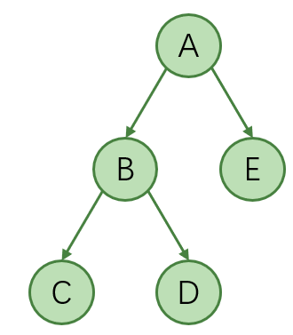
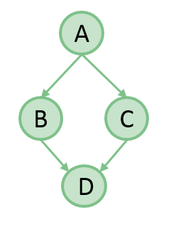
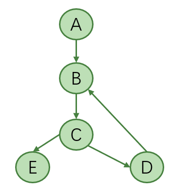
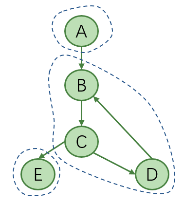

## 引言
经常能在一些编译器书籍资料中看到Reverse Post-order(RPO)这个名词，特别是在数据流分析相关章节中。比如下面的这句

```
  For a forward data-flow problem, such as Dom, the iterative algorithm should use an rpo computed on the cfg. For a backward data-flow problem, such as LiveOut, the algorithm should use an rpo computed on the reverse cfg.
```
 一般地，数据流分析的流向分为向前分析和向后分析，像前文说到的Available Expression分析和上面提到的Dominance分析，都属于向前的数据流分析。
 
 先来看向前的数据流分析，我们知道，在分析某个结点的时候，我们需要依赖当前结点的predecessors信息来推导关于当前结点的信息，所以计算的时候，我们应当按照这个顺序来访问结点，就是在这个访问序列中，结点的predecessors排在该结点的前面先被访问，这样会使得算法收敛迅速，如果CFG中没有环的话，一般地，以这个顺序遍历一遍就可以完成分析，得到我们想要的结果。
 
 那么问题来了，如何能够得到这样一个顺序呢？首先我们想到的是先序遍历，看起来貌似先序(pre-ordering)遍历可以满足我们的需要。来看一个例子： 
 


  在这个例子中，
 

    对其进行先序遍历，得到序列A->B->C->D->E（或者A->E->B->D->C），这个序列是满足每个结点的predecessor都排在该结点前面的
    对其进行后序(post-ordering)遍历,得到序列C->D->B->E->A（或者E->D->C->B->A），那么将其逆过来，得到RPO(Reverse Post-ordering)序列，即，A->E->B->D->C（或者A->B->C->D->E），这个序列也是满足每个结点的predecessor排在该结点前面这个约束的

 那么，拿到一个图，是否我们对其进行先序遍历就可以？答案是否定的，上面这个例子之所以可以，是因为这个例子中的图比较特殊，它是一个Tree，所以对其进行先序遍历得到的序列也是能够满足约束的。
 
 前文我们说过Tree属于DAG，我们下面看一个更泛化一点的DAG图的例子[1]： 
 


    对其进行先序遍历，得出A->B->D->C (或者A->C->D->B), 很明显，图中D的predecessors为B和C，但是C并没有都在其前面被遍历到
    对其进行后序遍历，得出D->B->C->A (或者D->C->B->A)，那RPO就是把后序遍历的结果逆过来，即，A->C->B->D(或者A->B->C->D)，这个序列依然满足上述约束

 综上，一般地，对DAG的先序遍历可能不能满足我们的需求，而其RPO却可以满足我们的需求。
 
 注：上面这个图是DAG(有向无环图)，对于DAG来说，RPO的结果和对该图进行拓扑排序得出的结果是一致的，这个我们在前文中是有提及的。
 
  我们知道DAG属于Digraph，我们看一个更泛化的含有cycle的Digraph的例子：


      对其进行先序遍历，得出A->B->C->E->D(或者A->B->C->D->E)
    对其进行后序遍历，得出E->D->C->B->A(或者D->E->C->B->A),然后reverse一下，得出RPO序列，即，A->B->C->D->E(或者A->B->C->E->D)

 不论先序遍历还是RPO遍历，B的predecessors中只有A是被先访问的，而D却仍然是在B之后被访问。在有cycle出现的地方，我们往往不能得出满足上述约束的一个序列，所以我们需要在iterative算法中多遍计算直至达到fix-point才可以。虽然这样，我们依然采用RPO作为结点的计算顺序，毕竟，这使得除cycle涉及的点外的其他点还是满足上述约束的，收敛算法也会收敛的迅速。
 
前文我们有提及到强连通分量SCC(Strongly Connected Component)的概念，其实上图可以划分成三个SCCs，如下： 
 


 单个结点构成的子图符合强连通分量的定义，所以只含有结点A的子图是一个SCC，同样地，只含有结点E的子图也是一个SCC，还有一个SCC就是结点B、C、D构成的子图。实际上，这个digraph就转成了由三个连通分量构成的DAG了，这个后面我们还会提及，这里先不提及。
 
 对于向后的数据流分析，比如前文提及的Liveness Analysis就是属于向后的数据流分析。对于这种，我们需要依赖当前结点的successors的信息来推导关于当前结点的信息，所以计算的时候，我们应当按照这个顺序来访问结点，就是在这个访问序列中，结点的successors排在该结点的前面先被访问，这样会使得算法快速收敛，如果CFG中没有环的话，一般地，以这个顺序遍历一遍就可以完成相关信息的计算和收集。
 
 一般地，对于向后的数据流分析，要么1）采用Post Order得出的结点顺序来进行分析，要么2）将CFG进行reverse，然后对reverse后的CFG进行RPO，以RPO得出的结点的顺序来进行分析。
 
 给定一个Digraph，这两种方式的优劣目前我还没找到数据支撑。
 
参考文献
 [1] Depth-first_search,https://en.wikipedia.org/wiki/Depth-first_search 
 
 [2] Engineering a Compiler 2nd, Page 481 
 
 [3] Directed graph traversal, orderings and applications to data-flow analysis, https://eli.thegreenplace.net/2015/directed-graph-traversal-orderings-and-applications-to-data-flow-analysis/