## 环境简介
笔者的电脑是一款Win10笔记本电脑（内存16GB * 2），通过VMware® Workstation 15 Pro虚拟机虚拟出一个
[Ubuntu 20.04](https://releases.ubuntu.com/20.04/)操作系统实例。
详细的参数如下图：

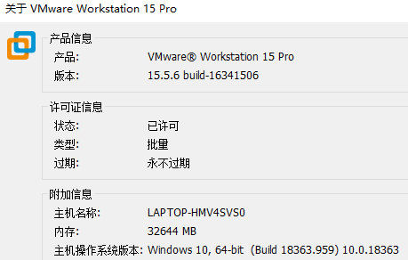

分配给这个虚拟机实例的资源配置如下：
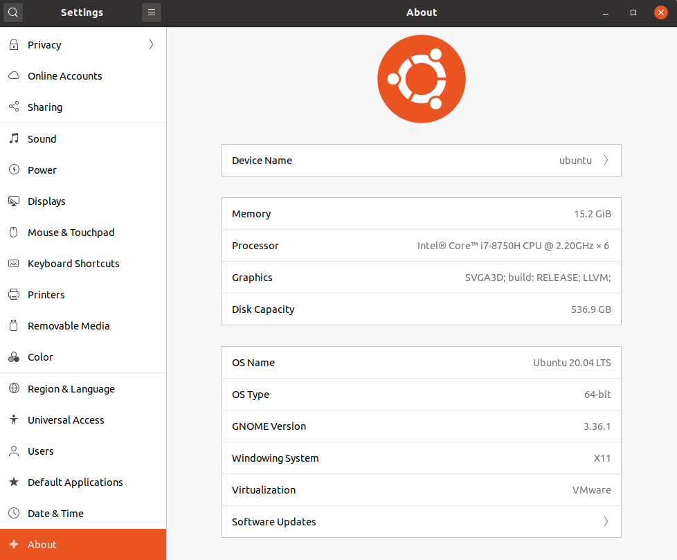

我给ubuntu实例分配了500+GB的磁盘，并分配了22GB的内存（因为编译AOSP很耗费内存），现在编译完了，笔者又把它手动调低到了图中的16-GB。编译AOSP的时候，除了分配22GB的内存外，笔者还在ubuntu实例中分配了一个32GB的swap空间，担心内存不够，发生交换。快速创建swap空间可以参考[这篇文章](https://cloud.tencent.com/developer/article/1631696)。


## AOSP源码下载
由于墙的原因，在国内无法通过[AOSP官网](https://source.android.com/setup/build/downloading)介绍的方式来下载AOSP源码，如果你可以翻墙，那么你依据这个官网步骤来下载AOSP源码就好了。如果翻不了墙，可以通过清华大学提供的[国内镜像](https://mirrors.tuna.tsinghua.edu.cn/help/AOSP/)来下载AOSP源码。
```
wget -c https://mirrors.tuna.tsinghua.edu.cn/aosp-monthly/aosp-latest.tar # 下载初始化包
tar xf aosp-latest.tar
cd AOSP   # 解压得到的 AOSP 工程目录
# 这时 ls 的话什么也看不到，因为只有一个隐藏的 .repo 目录
```
首先通过上述这几个命令下载一个初始的包下来，然后在这个基础包的基础上，来获取你想要的特定版本的aosp源码，
因为笔者在淘宝上买了一个Pixel 2手机用来刷机的（欧版，已解锁），为了一次刷机成功，必须保证要刷一个确定版本的aosp源码。
从这个[官网](https://source.android.com/setup/start/build-numbers#source-code-tags-and-builds)可以获取特定版本支持的特定手机。对于笔者来说选择的是如下所示的AOSP代码。build号是QQ3A.200705.002，tag号是android-10.0.0_r40，记住这两个号。
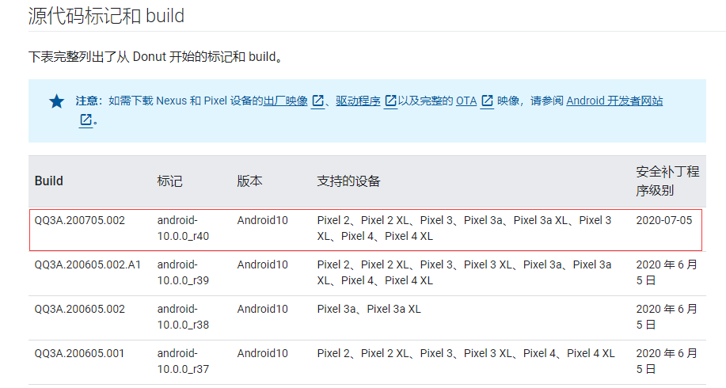

现在假设我们已经解压aosp-latest.tar并进入了目录AOSP下，我们执行下下面这个命令，告诉repo，我想要同步android-10.0.0_r40对应的AOSP代码。

```
repo init -u https://mirrors.tuna.tsinghua.edu.cn/git/AOSP/platform/manifest -b android-10.0.0_r40
```

上面这个命令执行完毕之后，我们就要开始从服务器上同步这个代码到本地了。同步的命令很简单，就是
```
repo sync
```
但是，在执行之前啊，我们需要设置下git，因为repo sync的过程中可能网络不好或者同步的git库太大之类的造成很多问题，
所以我们需要稍微配置下我们的git工具。说到配置软件等方面，国内的话，ubuntu 20.04的软件来源最好换成清华的源，
sudo vim /etc/apt/sources.list，将内容替换成如下内容：

```
deb https://mirrors.tuna.tsinghua.edu.cn/ubuntu/ focal main restricted universe multiverse
deb-src https://mirrors.tuna.tsinghua.edu.cn/ubuntu/ focal main restricted universe multiverse
deb https://mirrors.tuna.tsinghua.edu.cn/ubuntu/ focal-updates main restricted universe multiverse
deb-src https://mirrors.tuna.tsinghua.edu.cn/ubuntu/ focal-updates main restricted universe multiverse
deb https://mirrors.tuna.tsinghua.edu.cn/ubuntu/ focal-backports main restricted universe multiverse
deb-src https://mirrors.tuna.tsinghua.edu.cn/ubuntu/ focal-backports main restricted universe multiverse
deb https://mirrors.tuna.tsinghua.edu.cn/ubuntu/ focal-security main restricted universe multiverse
deb-src https://mirrors.tuna.tsinghua.edu.cn/ubuntu/ focal-security main restricted universe multiverse
```
替换完成之后，不要忘记执行下面命令，使得上面的修改生效：
```
sudo apt-get update
```
接着，我们重新从源代码来构建一款git出来，因为git默认使用的GnuTls经常造成repo sync过程产生错误，[参照这个文档](https://www.cnblogs.com/sddai/p/10209121.html)，我们构建一个采用openssl的git工具。

构建完成之后，我们接着来配置git的config文件，通过vim ~/.gitconfig这个选项来修改，替换http和https对应的属性值
，这些值使得我们在repo过程中，尽可能小出现错误。
```
[http]
  postBuffer = 1048576000
  sslVerify = false
  lowSpeedLimit = 0
  lowSpeedTime = 999999
[https]
  postBuffer = 1048576000
  sslVerify = false
  lowSpeedLimit = 0
  lowSpeedTime = 999999
[user]
  email = alanwilliams@foxmail.com
  name = zhenghanhan
```
这些都执行完毕后，我们就可以开始执行上面的repo sync命令了，坐等同步完毕，有时候一次性repo sync不成功，需要多执行几次，这个等待时间是蛮久的。同步完成之后，目录结构显示如下：

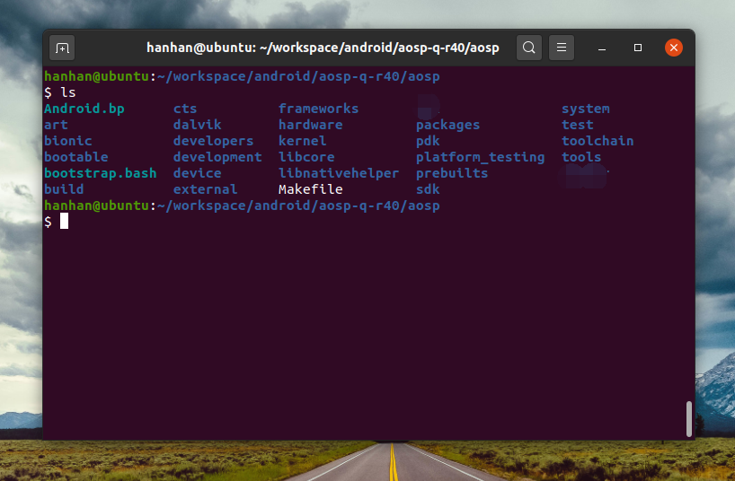

因为我们是要最终编译出image文件往Pixel 2手机上面刷机，所以我们还需要对应的驱动源码，放置在这个aosp目录下，我们还记得上面的build号是QQ3A.200705.002，依据这个build号，我们可以找到对应的[驱动文件](https://developers.google.com/android/drivers#walleyeqq3a.200705.002)，将这些驱动文件下载下来，解压后放置到aosp目录下，具体的步骤也可以参考[这篇文档](https://back2basics.io/2020/05/creating-a-android-aosp-build-machine-on-ubuntu-20-04/)。效果如下：

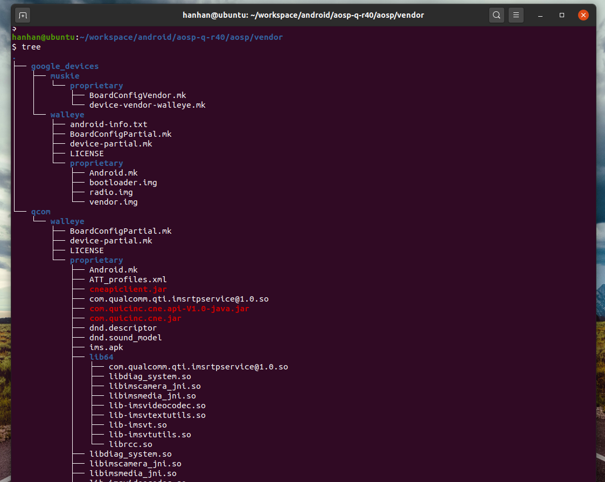

如果后面你刷机失败了，那么可以下载官方已经编译好的镜像进行刷机恢复，对于pixel 2,可以在[这个列表](https://developers.google.com/android/images#walleye)中下载官方image来进行恢复。

## AOSP编译

在编译之前，我们需要安装很多的工具、软件等，具体的，我依据这个[文档](https://back2basics.io/2020/05/creating-a-android-aosp-build-machine-on-ubuntu-20-04/)给出的列表进行了安装：
```
sudo apt install openssh-server screen python git openjdk-8-jdk android-tools-adb bc bison \
build-essential curl flex g++-multilib gcc-multilib gnupg gperf imagemagick lib32ncurses-dev \
lib32readline-dev lib32z1-dev  liblz4-tool libncurses5-dev libsdl1.2-dev libssl-dev \
libxml2 libxml2-utils lzop pngcrush rsync schedtool squashfs-tools xsltproc yasm zip zlib1g-dev \
libtinfo5 libncurses5
```

工具安装完毕之后，我们就可以开始准备编译了，在aosp根目录下，执行下面命令即可：
```
source build/envsetup.sh
lunch aosp_walleye-userdebug
m -j8
```
注意，我的手机是pixel2，所以我跟的是aosp_walleye-userdebug，对于不一样的测试机，需要选择不一样的配置。
编译完之后，显示如下：

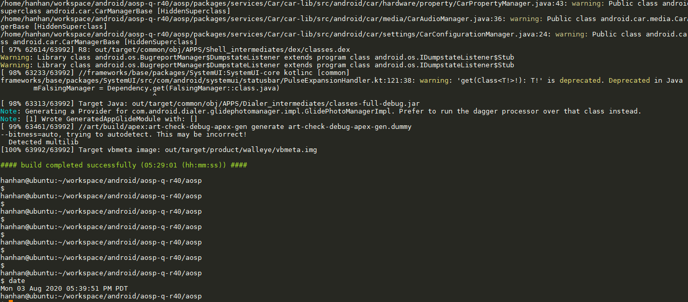

## 刷机
这个时候，我们就可以将pixel手机连接到虚拟机中了，请选择默认情况下将pixel 2直接连接到虚拟机中，而不是连接到本地机上，
因为在刷机的过程中，可能会数次重启，如果不是默认连接到虚拟机中的话，那么刷机的时候会中断，要手动每次去挂接到虚拟机中，这不仅麻烦，也会大概率使得刷机失败。注意，一定要打开usb调试选项才能使得电脑探测到手机，adb devices才能看到手机。
而且我们在手机界面还要选择同意电脑usb调试它：

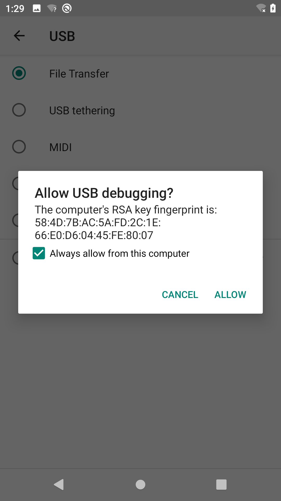

我们每次插拔手机的时候，如果usb设置仅仅是充电，那么电脑不一定能感知到这个手机，adb devices可能为空，我们可以手动设置下默认的usb插入行为是传输文件。如下面两张图：

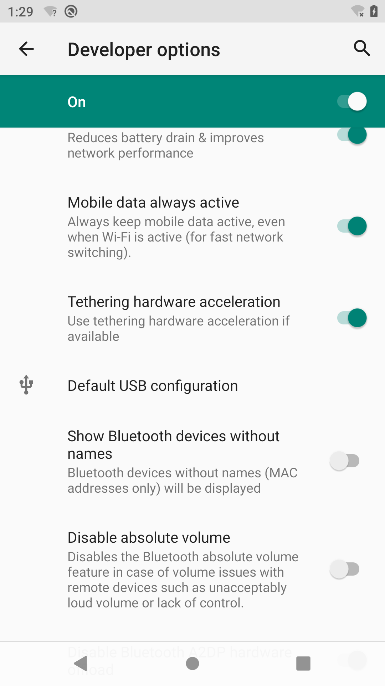

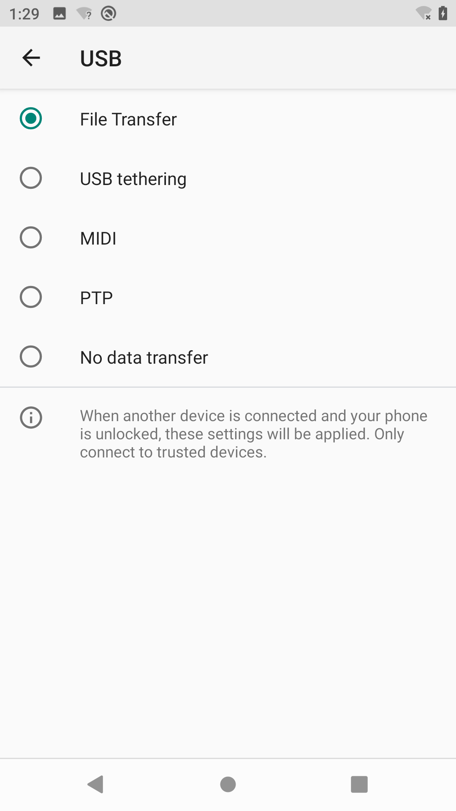

系统默认安装的adb 和 fastboot可能版本比较老，flash编译出来的image的时候，会提示版本太老，不能刷机，我们去[官网下载](https://developer.android.com/studio/releases/platform-tools#downloads)新的工具即可。

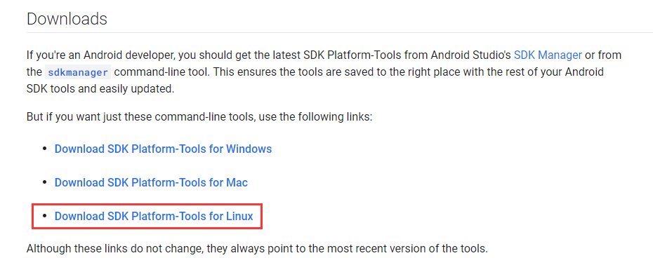

笔者下载下来之后，解压，在笔者机器上解压结果入下图：

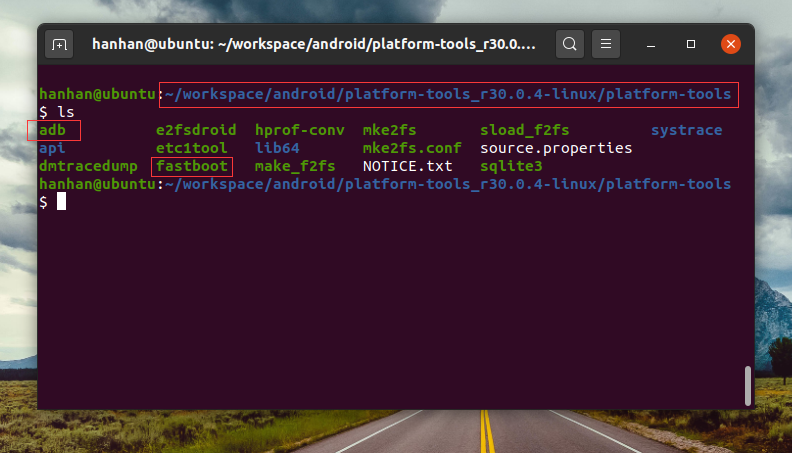

我们只需要将这个含有adb和fastboot的目录添加到PATH中即可，笔者在~/.bashrc这个配置文件末尾加上了如下一行
```
PATH=~/bin:/home/hanhan/workspace/android/platform-tools_r30.0.4-linux/platform-tools:$PATH
```
然后保存之后，执行了
```
source ~/.bashrc
```
这样就好了，我们后续使用的adb和fastboot都是这个目录下的adb和fastboot了

我们执行
```
adb reboot bootloader
```
就可以使得当前手机进入fastboot状态，这个状态下，我们执行下面命令进行刷机：
```
fastboot flashall -w
```
terminal中刷机命令执行成功的界面如下：

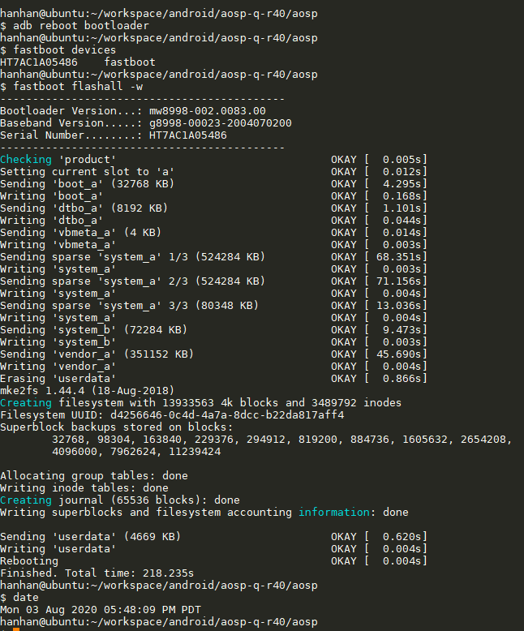

实体手机的界面如下：

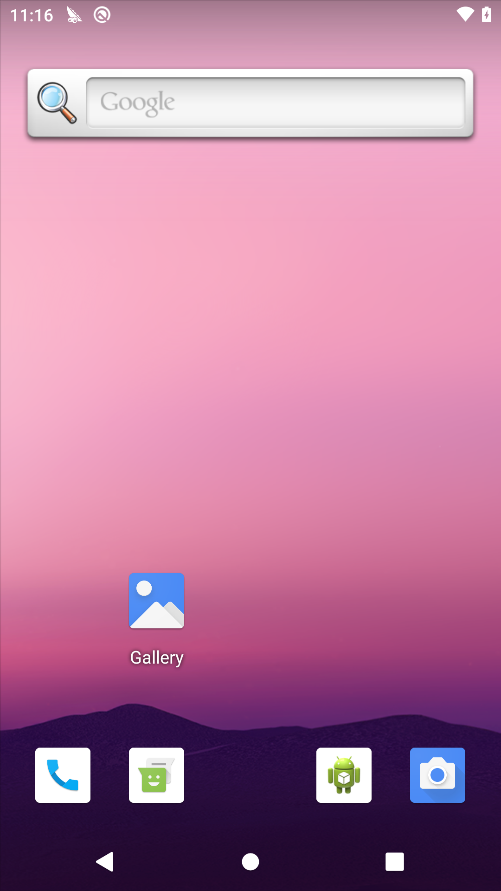


